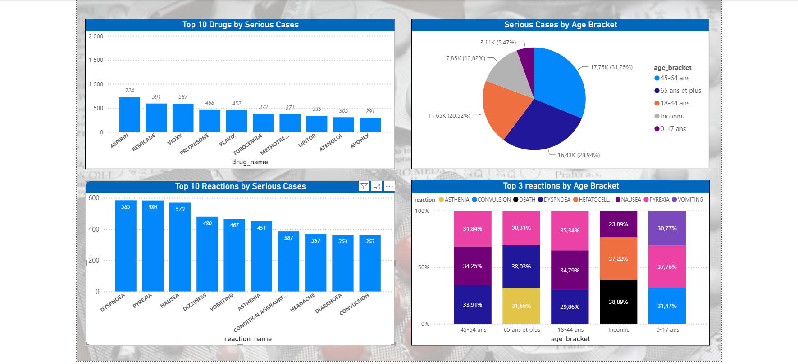

# Pharma DBT Fabric

Data pipeline on adverse drug event reports, built with Python, dbt, and
DuckDB — a portfolio project for a career transition into the Analytics
Engineer role.

## Business Question

This project answers a pharmacovigilance question: which drugs generate the
most serious adverse event reports, and which reactions are most commonly
associated with them?

Source: adverse event reports (FAERS) via the public openFDA API.

## Architecture

- **Extraction**: Python script paginating through the openFDA API, saving raw JSON.
- **Loading**: DuckDB reads the JSON files directly, with no separate copy/load step.
- **Transformation (dbt)**, in three layers:
  - `staging`: cleaning, typing, flattening of nested JSON.
  - `intermediate`: deduplication of reports and propagation to drugs/reactions.
  - `marts`: two fact tables (`fct_drug_adverse_events`, `fct_reaction_adverse_events`) answering the business question.
- **Delivery**: Power BI dashboard, built locally with Power BI Desktop from CSV exports (see the "Power BI Dashboard" section below).

### Why DuckDB Instead of Microsoft Fabric

The project originally targeted Microsoft Fabric. The free trial ran into an
eligibility restriction affecting recently created personal tenants (a
documented issue, unrelated to the project's own configuration). Development
was decoupled from the target warehouse: the project runs on DuckDB locally,
and thanks to dbt's adapter architecture, switching to Fabric (or any other
warehouse) only requires a configuration change, with no SQL rewrite.

## How to Run This Project

1. Clone the repo and create a virtual environment:
```bash
   git clone https://github.com/dahibmarouan/pharma-dbt-fabric.git
   cd pharma-dbt-fabric
   py -3.12 -m venv venv
   .\venv\Scripts\Activate.ps1
   pip install -r requirements.txt
```

2. Create a `.env` file at the project root with a free openFDA API key
   (obtained at https://open.fda.gov/apis/authentication/)

3. Run the raw data extraction:
```bash
   python scripts/extract_openfda.py
```

4. Build and test the dbt project (this single command builds all three
   layers — staging, intermediate, and marts — in dependency order, and
   runs every test):
```bash
   cd pharma_project
   dbt build
```

5. (Optional) Generate and view the documentation:
```bash
   dbt docs generate
   dbt docs serve
```

## Power BI Dashboard

The dashboard answers the business question through four visuals:
- Top 10 drugs associated with serious cases
- Top 10 reactions associated with serious cases
- Distribution of serious cases by age bracket
- Top 3 serious reactions by age bracket (DAX measure: partitioned `RANKX`)

File: `dashboard/pharma_dashboard.pbix` (requires Power BI Desktop, free).



## Updating the Power BI Dashboard

The dashboard imports data from static CSV files (Power BI's native DuckDB
connector relies on an ODBC driver that proves unreliable in practice). To
refresh the figures after a data change:

1. From the project root (with `venv` active), run the script that rebuilds
   the dbt models and regenerates the CSV exports:
```powershell
   .\scripts\refresh_data.ps1
```
2. In Power BI Desktop: Home → Refresh.

(Step 2 remains manual: scheduled automatic refresh requires the Power BI
Service with a Pro license, deliberately avoided here.)

## Challenges Encountered and Decisions Made

**Sampling bias detected**: of the first 500 reports extracted, 499 were
flagged as duplicates by openFDA.

**First hypothesis (invalidated)**: widening the sample to 20,000 reports
would be enough to dilute the bias. Verification after extraction:
19,380/20,000 (96.9%) were still flagged as duplicates — the hypothesis was
wrong.

**Real diagnosis**: the openFDA API returns results in an undocumented
internal order. The duplicate report IDs followed an almost continuous
sequence, a sign of a single large batch of mass submissions grouped by this
default ordering.

**Effective fix**: added an explicit sort (`sort=receivedate:asc`) to page
through reports by date rather than the API's internal order. Result: ~2%
duplicates — a rate consistent with the literature on FAERS data. A
defensive deduplication step was also added on the extraction side, as a
safeguard against pagination overlaps.

**Technical constraint discovered**: the openFDA API caps `skip` at 25,000,
meaning a maximum of 26,000 reports are reachable through simple pagination
(skip/limit). Beyond that, the `search_after` (cursor) strategy would be
required — out of scope for this project.